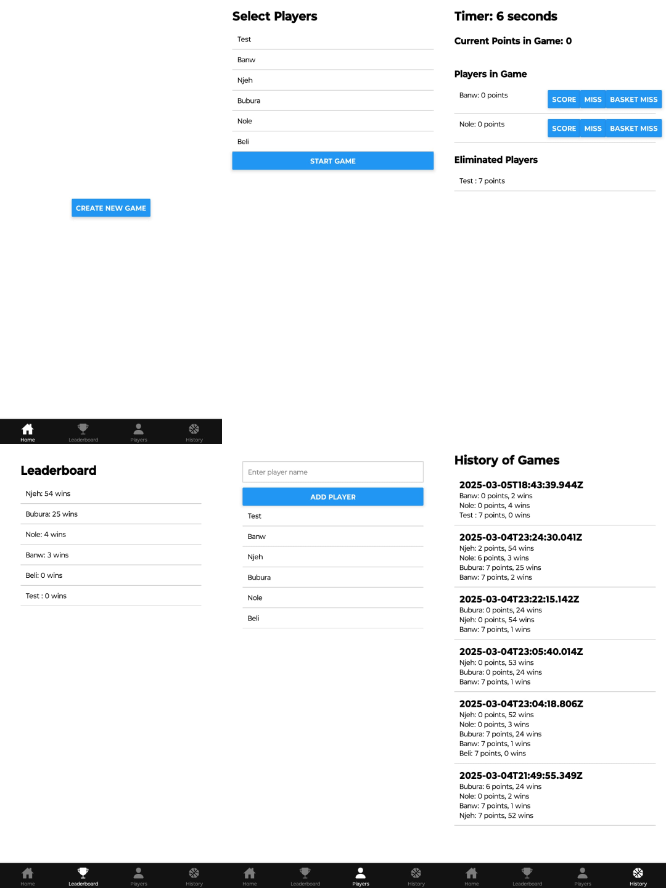

# SevenUpTracker


**SevenUpTracker** is a mobile application developed using React Native and Firebase that allows users to track the game of SevenUp.

**Note:** This project is currently under development. It is not yet complete and may contain bugs.

## Features

- **Add Players** – Create a list of players before starting the game.
- **Score Tracking** – The app automatically records the results of each round.
- **Player Deactivation** – A player is deactivated upon reaching 7 points.
- **Win Counter** – Track the number of wins for each player across multiple games.
- **Leaderboard** – View the top players based on games won.

## Installation

1. **Clone the repository:**
   ```bash
   git clone https://github.com/crnapagoda/sevenup-tracker.git

2. **Navigate to the project directory:**
   ```bash
   cd sevenup-tracker
   ```

3. **Install dependencies:**
   ```bash
   npm install
   ```

## Running the Application

To run the application, use the following command:
```bash
npx expo start
```
Afterward, you can scan the QR code using the Expo Go app on your phone or launch an emulator.

## Technologies

- **React Native** – For developing the user interface
- **Firebase** – For authentication and data storage
- **Expo** – For easier development integration

## Planned Development

- Adding user authentication
- Improving the user interface
- Implementing game history
- Testing and bug fixes

